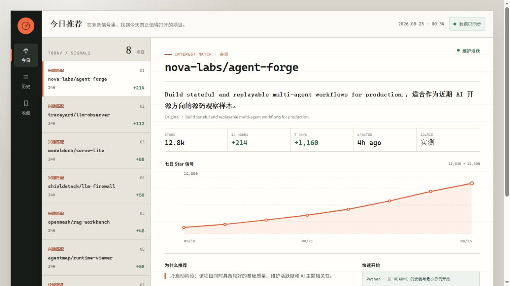
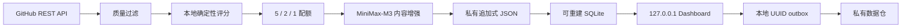

# AI Repo Radar

每天从 GitHub 官方 API 发现值得关注的 AI 开源项目，用确定性规则完成过滤与排序，再由 MiniMax-M3 为最终项目补充中文摘要。结果保存在你的私有数据仓，并通过只监听 `127.0.0.1` 的 Signal Ledger 工作台查看和反馈。

English: a local-first, explainable AI GitHub repository radar with deterministic ranking, optional MiniMax-M3 content enrichment, an append-only private data repository, and a FastAPI + Jinja + HTMX dashboard.

> v0.1.0 已完成固定样例、核心推荐链路、云端客户端、本地 Dashboard、反馈 outbox、两仓 workflow 与自动化测试。真实 Secret 冒烟和连续 7 天线上运行必须在你自己的私有仓完成。



## 它解决什么问题

GitHub Trending 告诉你“大家正在看什么”，AI Repo Radar 更关心三件事：项目是否达到最低质量、增长是否相对自身基线异常、以及它是否逐渐贴近你的显式兴趣。

- 大模型不参与名次决定，固定输入会产生固定输出。
- 前 7 天用质量、增长与探索冷启动；第 8 天起使用 5 个兴趣位、2 个涨星位、1 个探索位。
- “更多此类 / 收藏 / 不相关 / 已了解”都是 UUID 事件，次日才改变推荐；误触可在“反馈”页追加撤回事件，原记录不会被删除。
- MiniMax 只接收最终公开仓库的必要字段与公开 README 片段，不接收私人反馈、收藏、权重或推荐原因。
- 私有 JSON 是唯一事实源，SQLite 只是随时可删除重建的本地视图。

## 5 分钟本地体验

需要 Python 3.11+ 和 [uv](https://docs.astral.sh/uv/)。固定样例完全离线，不需要 Token：

```powershell
git clone https://github.com/YOUR_OWNER/ai-repo-radar.git
cd ai-repo-radar
uv sync --all-groups
uv run ai-repo-radar sample `
  --data-dir .local/sample-data `
  --database .local/sample.sqlite3
uv run ai-repo-radar serve `
  --data-dir .local/sample-data `
  --database .local/sample.sqlite3
```

浏览器会打开 `http://127.0.0.1:8765`。固定样例包含正常、估算、过滤、增长、中文增强和反馈所需的数据。样例引用打包时已验证可访问的公开仓库链接，但 Star、增长和更新时间是用于确定性测试的固定演示值；真实日报请运行 `daily`。重复运行 `sample` 会安全刷新同日样例日报。
如果 8765 已被占用，可在 `serve` 命令末尾追加 `--port 8766`（或其他空闲端口）。

## 架构



项目采用两个 GitHub 仓库：

| 仓库 | 可见性 | 保存内容 |
|---|---|---|
| `ai-repo-radar` | Public | Python 代码、样例、测试、可复用 workflow、文档 |
| `ai-repo-radar-data` | Private | 日报、快照、反馈、兴趣画像、个人配置与 Actions Secrets |

私有仓调用公开仓的 `radar-daily.yml@v0.1.0`，默认 `GITHUB_TOKEN` 只写调用方私有仓，不需要跨仓高权限 PAT。完整设计见 [架构说明](docs/ARCHITECTURE.md)。

## 运行真实每日任务

先复制配置并把真实值留在 shell 或 GitHub Actions Secrets：

```powershell
Copy-Item config.example.toml config.toml
$env:GITHUB_TOKEN = "<current-shell-only>"
$env:MINIMAX_API_KEY = "<current-shell-only>"

uv run ai-repo-radar daily `
  --data-dir D:\Github\ai-repo-radar-data\data `
  --database D:\Github\ai-repo-radar-data\.cache\radar.sqlite3 `
  --config D:\Github\ai-repo-radar-data\config.toml
```

MiniMax 缺 Key、超时、限额或响应异常时，命令仍保存规则排序并把日报标成降级；GitHub 数据失败或事实写入失败则明确失败，不会用不完整日报覆盖有效结果。

## 私有数据仓与定时任务

仓库旁提供了独立的 `ai-repo-radar-data` 本地骨架。发布前：

1. 将它创建为 GitHub **Private** 仓库。
2. 把 `.github/workflows/daily.yml` 中两处 `your-github-owner` 改成真实 owner。
3. 在私有仓 Actions Secrets 新增 `MINIMAX_API_KEY`。
4. 公开代码仓发布不可变 tag `v0.1.0`。
5. 手动运行一次，再启用北京时间 08:30 的日程。

私有仓 workflow 自动使用调用仓的 `github.token` 读取 GitHub API，并只提交 `data/`。详见 [运维手册](docs/OPERATIONS.md)。

## 本地反馈同步

Dashboard 点击反馈后会先写 `data/outbox/<UUID>.json`，并立即出现在“反馈”页。该页面会显示动作、提交时间、生效日期、同步状态和当前状态；“撤回反馈”会追加一条次日生效的抵消事件，不删除原事件。只有数据目录位于带 `.ai-repo-radar-private` 标记的私人 Git 仓中，状态面板才会启用“立即同步到私有仓”；点击后会拉取、提交并推送。也可以使用等价的 CLI 重试：

```powershell
uv run ai-repo-radar sync-data `
  --data-dir D:\Github\ai-repo-radar-data\data `
  --database D:\Github\ai-repo-radar-data\.cache\radar.sqlite3
```

样例或普通目录会明确显示“反馈仅本地”，不会误执行推送。断网、远端冲突或凭据不可用时，事件转为 `pending_retry` 并保留在 outbox。同步器复用 Git Credential Manager 或 Git 自身凭据，不读取或保存明文 Token。

## CLI

| 命令 | 用途 |
|---|---|
| `sample` | 跑固定 JSON 的候选 → 日报 → SQLite 闭环 |
| `daily` | 调用 GitHub 与 MiniMax，生成真实日报 |
| `serve` | 尝试同步私有仓、重建缓存并启动本地 Dashboard |
| `sync-data` | 重试 outbox，同步私有事实并重建缓存 |
| `rebuild-cache` | 只从 JSON 重建 SQLite |
| `profile` | 查看可解释 Topic 权重 |
| `doctor` | 检查数据目录、缓存和 Secret 是否就绪，不打印 Secret |

使用 `uv run ai-repo-radar COMMAND --help` 查看参数。

## 评分与数据

默认总分由兴趣 30%、基础质量 28%、增长 24%、健康度 12%、新颖性 6% 组成。硬过滤会排除归档、禁用、Fork、镜像、180 天未维护、无描述、无 README 和低于 10 Stars 的项目。低基数保护避免小仓库因百分比变化被误判为爆发。

日报、快照、反馈和画像字段及保留策略见 [数据说明](docs/DATA_SCHEMA.md)。评分逻辑位于 `src/ai_repo_radar/scoring.py`，没有隐藏向量或在线训练模型。

## 开发与验证

```powershell
uv sync --all-groups
uv run ruff check src tests scripts
uv run pytest --cov=ai_repo_radar --cov-report=term-missing
uv run python scripts/privacy_audit.py
uv build
```

测试覆盖过滤、增长基线、低基数保护、反馈次日生效与幂等、5/2/1 配额、JSON → SQLite 重建、GitHub/MiniMax 模拟响应、Dashboard/CSRF、Git outbox 重试和隐私扫描。

## 安全边界

- Dashboard 在配置层硬锁 `127.0.0.1`，并启用 CSP、CSRF、本地 Origin 校验和禁缓存响应头。
- 真实 Token、私人 JSON、SQLite、outbox 和 `.env` 均被公开仓 `.gitignore` 排除。
- CI 扫描被 Git 跟踪的 Secret 形态与私人事实路径。
- 外部 GitHub 链接使用 `noopener noreferrer`；所有写入操作均先落本地事实文件。

提交安全问题或公开前请先阅读 [SECURITY.md](SECURITY.md)。

## 当前发布门槛

代码侧门槛可自动验证；以下两项必须由仓库所有者在私有环境完成后再把项目标记为稳定：

- 使用真实 GitHub / MiniMax Secret 的一次 Actions 冒烟。
- 连续 7 天的真实定时运行与第 8 天兴趣配额验证。

## License

[MIT](LICENSE) © 2026 Xu Wenjie
